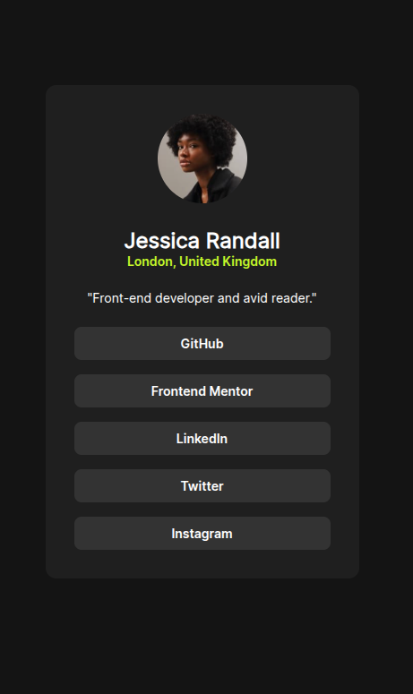

# Frontend Mentor - Social links profile solution

This is a solution to the [Social links profile challenge on Frontend Mentor](https://www.frontendmentor.io/challenges/social-links-profile-UG32l9m6dQ). Frontend Mentor challenges help you improve your coding skills by building realistic projects. 

## Table of contents

- [Overview](#overview)
  - [The challenge](#the-challenge)
  - [Screenshot](#screenshot)
  - [Links](#links)
- [My process](#my-process)
  - [Built with](#built-with)
  - [What I learned](#what-i-learned)
  - [Continued development](#continued-development)
  - [AI Collaboration](#ai-collaboration)
- [Author](#author)

**Note: Delete this note and update the table of contents based on what sections you keep.**

## Overview

### The challenge

Users should be able to:

- See hover and focus states for all interactive elements on the page

### Screenshot

### Links

- Solution URL: [solution repository](https://github.com/Nandog20/Social-Links-Frontend-Mentor)
- Live Site URL: [Add live site URL here](https://socialinksfm.netlify.app/)

## My process
The first thing i did was creating a main to contain all the information, after separated in sections the image, info and links, then, using flexbox for position, and get everything centered, at the end just set background colors, use links like buttons and change the typography
### Built with

- Semantic HTML5 markup
- CSS custom properties
- Flexbox

### What I learned

Understanding how to use different weights on custom fonts, practice with flexbox and add section instead of divs.

### Continued development

I need to focus more on how to lay out the page, better understand the issue of the heights and widths of each element and flexbox

### AI Collaboration

I used chatGPT to understand how to change the weight on a font, get ideas for the layout

## Author

- Github - [Nandog20](https://github.com/Nandog20)
- Frontend Mentor - [@Nandog20](https://www.frontendmentor.io/profile/Nandog20)
